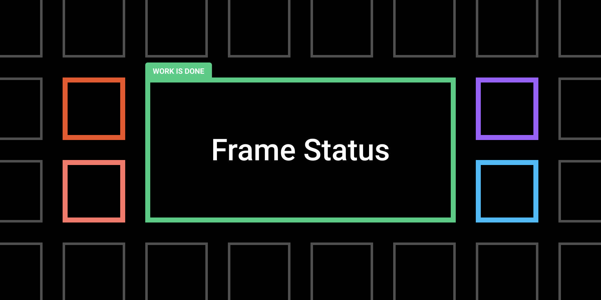

### What it is?

Frame Status is a simple plugin used to indicate the status of a screen of a project.

### Why?

We try to help thousands of collaborative teams with this simple plugin, we are one of those teams and we can help others. Frame Status indicates the state of a screen on the project. For example: as a designer, you need to indicate the state of your work for your team, stakeholders and clients.

### How to use?

Select a frame > Navigate to the Plugins menu > Select Frames Status and them > Select the status of your frame.

### Tips
- You can select multiple frames at once. Each frame will get its own status badge.
- Use the keyboard shortcut to quickly set a status: hit `cmd /` in Mac and `ctrl /` on Windows, type a Status (e.g. “Done”) and hit return.

Frame Status is open source, feel free to contribute or to send suggestions: https://github.com/hecvr/status-for-figma.

Based on Status by Bram Schulting, see it on [GitHub](https://github.com/bramschulting/status-for-figma).